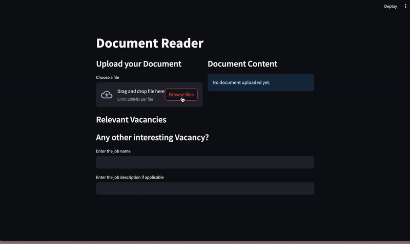

# CV-Matching

## Demo



## Technologies

- Python
- Hugginface infrastructure, Pytorch Lightning, CatBoost, NumPy for ML Part
- Streamlit for a web-service
- Pandas and Jupyter notebooks for data preprocessing and analysis
- **ClearML for dataset versioning** (TODO)

### Methodology

В качестве основы нашей работы мы используем векторное представление текстов (резюме/вакансии) с использованием
предобученных эмбедингов для русского языка. Мы обучаем модели машинного обучения, которые получают на вход
сконкатенированные векторы резюме и вакансии и на выходе предсказывают релевантность (вероятность) данного резюме к
данной вакансии.

В результате, обученная модель используется поиска релевантных вакансий, которых могло даже не быть в датасете. Также,
обученная модель позволяет выдавать релевантность конкретной вакансии к конкретному резюме.

## Data Preprocessing

Первая часть предварительной обработки сосредотачивается на наборе данных по вакансиям. Релевантные столбцы выбираются
на основе их значимости для процесса сопоставления, включая название вакансии, тип бизнеса, зарплату, образование,
требуемый опыт, знание языков, профессиональные и мягкие навыки.

Столбцы `hardSkills`, `softSkills` и `languageKnowledge` изначально содержащие информацию в формате JSON, анализируются
и преобразуются в удобочитаемые форматы. Это включает в себя извлечение соответствующей информации из структуры JSON и
соответствующее форматирование. Кроме того, создается новый столбец с именем `data`, объединяя выбранные столбцы для
консолидации соответствующей информации о каждой вакансии, после чего набор данных изменяется, чтобы сохранить только
столбцы `vacancy_name` и `data`, что оптимизирует информацию, необходимую для последующих задач моделирования.

Для набора данных по резюме определенные имена столбцов стандартизированы для обеспечения единообразия. Этот шаг
обеспечивает унификацию между различными наборами данных и облегчает извлечение признаков и обучение модели.

## Training Pipeline

### Dataset

В качестве разбиения на `train` `test` `validation` была выбрана пропорция 80:10:10.
Из-за того, что датасет изначально
был сбалансирован проводилась случайная выборка без дополнительной стратификации. В процессе обучения, модель видела
только `train` множество, после каждой эпохи считались метрики на `validation` множестве, чтобы предотврадить
переобучение (где применимо) и обученная модель валидировалась на `test` множестве

### Metrics

В качестве метрик было выбрано 2 метрики: **Brier Score** и **ROC-AUC**. Первая метрика была выбрана из-за возможности
работы с непрерывными значениями вероятностей без необходимостей приведения предсказаний модели к логитам. Вторая
метрика, использовалась для оценки уверенности модели при подаче предсказаний.

| Metric      | Works with continuous predictions | Works with continuous True values score |
|-------------|-----------------------------------|-----------------------------------------|
| Brier Score | :white_check_mark:                | :white_check_mark:                      |
| ROC-AUC     | :white_check_mark:                | :x:                                     |

## Testing and Validation

### Experimental Setup

В качестве экспериментов были обучены и провалидированы декартово множество всех моделей и всех эмбедингов на всех
обозначенных выше метриках. Результат считался положительным, если при кросс-валидации на тестовом датасете метрика
превышала 0.5, так как
данный результат может
считаться не случайным.

### Experiments

| Model                     | Embedding                      | Brier score | ROC-AUC | 
|---------------------------|--------------------------------|-------------|---------|
| **Linear Regression**     | **RuBERT-tiny**                | 0.35        | 0.36    |
| **Linear Regression**     | **RuBERT**                     | 0.21        | 0.29    |
| **Linear Regression**     | **Slavic BERT**                | 0.36        | 0.33    |
| **Linear Regression**     | **Sentence RuBERT**            | 0.41        | 0.36    |
| **Linear Regression**     | **Sentence Multilingual BERT** | 0.24        | 0.22    |
| **CatBoost Regressor**    | **RuBERT-tiny**                | 0.63        | 0.51    |
| **CatBoost Regressor**    | **RuBERT**                     | 0.62        | 0.69    |
| **CatBoost Regressor**    | **Slavic BERT**                | 0.62        | 0.58    |
| **CatBoost Regressor**    | **Sentence RuBERT**            | 0.63        | 0.59    |
| **CatBoost Regressor**    | **Sentence Multilingual BERT** | 0.61        | 0.69    |
| **Two Layers Perceptron** | **RuBERT-tiny**                | 0.66        | 0.74    |
| **Two Layers Perceptron** | **RuBERT**                     | 0.74        | 0.63    |
| **Two Layers Perceptron** | **Slavic BERT**                | 0.61        | 0.62    |
| **Two Layers Perceptron** | **Sentence RuBERT**            | 0.6         | 0.61    |
| **Two Layers Perceptron** | **Sentence Multilingual BERT** | 0.7         | 0.61    |

## Deployment

Все модели были реализованы с использованием абстрактных интерфейсов, что позволяет единообразно использовать их в
сервисе и при необходимости добавлять новые модели. Взаимодействие моделей с пользователем происходит через streamlit
web-service. При загрузке своего резюме пользователю предлагается список из 5 самых релевантных вакансий.

## Product Details

### Context

Мы решили сосредоточиться на помощи людям, которые ищут подходящую вакансию с уже готовым резюме. В нашем сервисе мы
предлагаем возможность найти релевантные вакансии, соответствующие резюме пользователя, а также проверять релевантность
резюме к определенной вакансии.

### Interface

Изначально, пользователю предлагается загрузить свое резюме -- мы реализовали подгрузку резюме в формате Word, так как
это самый популярный формат резюме в 2023 году. После того, как пользователь загрузил свое резюме оно отобразится справа
на главной странице, а снизу будет показан список релевантных ваканский.

Под списком популярных вакансий пользователь может дополнительно заполнить информацию об интересующей его вакансии,
которая может быть совершенно уникальной и получить персональное предсказание от модели, соответствует ли его резюме
данной вакансии или нет.

### Scaling

Для того, чтобы улучшить пользовательский опыт пользования нашим сервисом, мы выбрали использование продвинутных
эмбеддингов, а не тяжелых моделей. Данное решение позволяет посчитать эмбеддинги датасета отдельно в оффлайн режиме, а в
онлайне обрабатывать только пользовательские запросы, что положительно сказалось на общей производительности.

Помимо этого, мы реализовали сервис и бэкэнд, используя парадигму ООП и реализовали соответствующие интерфейсы, таким
образом масштабировать нас сервис и добавлять функциональность очень удобно.

## How to run

Для того, чтобы запустить web сервис изначально нужно восстановить виртуальное окружение:

```shell
poetry shell
poetry install --with web
```

И запустить сервис

```shell
poetry run streamlit run web/app.py
```

PS Первый раз запуск может быть более длительным из-за скачивания необходимых эмбеддингов